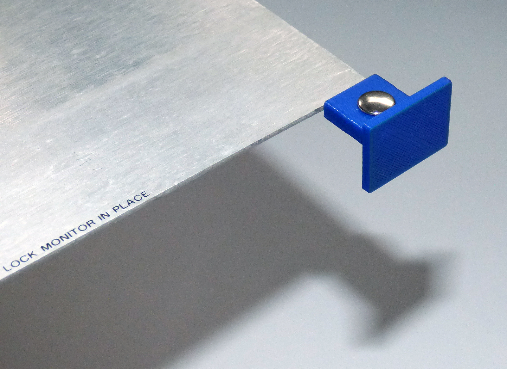

HP 9836 color monitor cable hood

For building a replacement for the monitor cable I used a VGA cable with shielded R, G, B wires and these shells.
After testing, both halves were simply glued together.

HP 9836 monitor locking plate handle

The HP 9836 monitor is locked into the case by a sliding aluminum plate with two square plastic handles.
The material of these handles becomes brittle and often their corners break, leaving only ugly fragments of the handles.
You can remove the nickel plated brass rivets after thinning their hollow ends by drilling with a 5-6 mm drill bit to about 1 mm depth.
This just removes part of the widened end so that the rivets can be pushed out, e.g. with a 3 mm steel pin and a hammer.
Then you can mount the new handles and install the rivets again simply by pressing them in using a vise.

