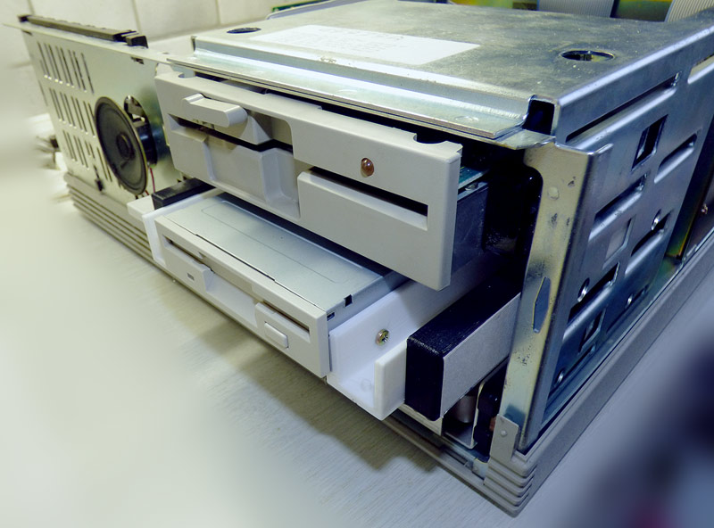

These parts can be used to install a 3.5 inch flexible disk drive into the early HP-Vectra PC drive cage, using sliding side rails.
The small rectangular block can be glued onto the rail with rubber cement, allowing for adjusting the depth position to match the front bezel.
If necessary, it can be broken lose to remove the disk drive.
I also glued strips ofcardboard to the side of the rails to achieve smooth motion with a bit of friction.

</img>
