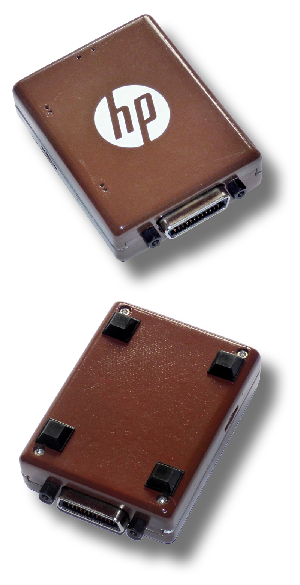

<h1>Parts for HP-IB Devices</h1>
<ul>
<li>Case for the HP85Disk PCB</li>
</ul>

<em>The HP-logo was created with a vinyl cutter which was found on the curb. 
  Only the repair of the broken power connector and a set of new knifes was necessary. Plus some investigation about the almost forgotten Houston Instruments DMPL plotter language to make it useful again...</em>

