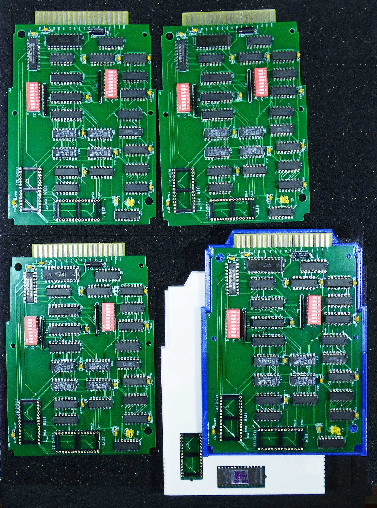

<h1>Parts for Series-80 Computers (85, 86, 87, 9915)</h1>

<ul>
  <li>case for interface modules, PRM-85 module or other new developments (what about that new color graphics board you wanted to develop?),</li>
  <li>EPROM-Drawer-Bot and EPROM-Drawer-Top make a module case for a reporduction EPROM drawer, using the slightly modified PCB created by Tony Cox.</li>
  <li>Replacement plungers for Series-80 keyboards (requires UV-resin printer).</li>
</ul>

<h2>Notes</h2>
I use small M 2.5 screws with brass inserts to close the cases. thin brass washers can be glued into the recesses to provide a stronger surface for the screw heads.
Inserts and washers can be glued in with steel filled epoxy in double syringes which gives a stronger and harder bond than the more flexible clear epoxy glues.
Self tapping screws do not go well with PLA - maybe you have better luck or use ABS.

The EPROM-Drawer module case is about 10 mm longer than the standard module case. The reason for this: unfortunately, the PCB layout created ny Tony Cox is a bit larger than the original layout and I do not have a possibility to modify it easily.
Also portions of the the side edges of the PCB have to be milled away to make the PCB fit into the module case. All this must be done before placing components on the board, of course.
The openings in the top allow for using standard sockets and also to see which EPROMs are installed. The original drawer uses semi-buried sockets which seem to be unobtainium today.

